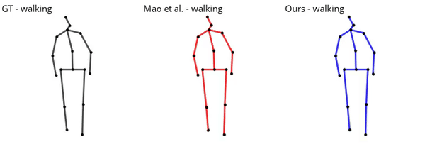

# motion-prediction-tim

This repo contains the code for the ACCV 2020 paper [Motion Prediction using Temporal Inception Module](https://arxiv.org/abs/2010.03006). 
We only support the H3.6M dataset for now and support for the CMU dataset will come later.
Implementation is done in [PyTorch](https://pytorch.org/).
### Download data

The human3.6m dataset is in exponential map format.

```bash
git clone https://github.com/tileb1/motion-prediction-tim
cd motion-prediction-tim
mkdir data
cd data
wget http://www.cs.stanford.edu/people/ashesh/h3.6m.zip
unzip h3.6m.zip
rm h3.6m.zip
cd ..
```
### Dependencies
* Download [PyTorch](https://pytorch.org/) with cuda (tested with 1.6.0)
* ```pip install -r requirements.txt```

### Train the model
Run the [main_3d.py](main_3d.py) file. Command line args are defined in [opt.py](utils/opt.py).
```bash
python main_3d.py
```

### Results
Average MPJE for short term prediction over 5 runs (all actions included)

| 80ms | 160ms | 320ms | 400ms |
|------|-------|-------|-------|
| 11.4 | 24.3  | 50.4  | 60.9  |

Average MPJE for long term prediction over 5 runs (walking, eating, discussion, smoking)

| 560ms | 1000ms |
|-------|--------|
| 49.6  | 68.6   |

Long term visualisation of our method compared to previous SOTA Mao et al. (2019)



### Pretrained models
Two pretrained models (long term and short term) are to be found in [checkpoint/pretrained](checkpoint/pretrained) and can be loaded with

```python
from utils.opt import Options
import utils.model as nnmodel
import torch

opt = Options().parse()
model = nnmodel.InceptionGCN(opt.linear_size, opt.dropout, num_stage=opt.num_stage, node_n=66, opt=opt)
model.load_state_dict(torch.load('checkpoint/pretrained/name.pth.tar', map_location=torch.device('cpu'))['state_dict'])
```

### Citing

If you use our code, please cite our work

```
@misc{2010.03006,
Author = {Tim Lebailly and Sena Kiciroglu and Mathieu Salzmann and Pascal Fua and Wei Wang},
Title = {Motion Prediction Using Temporal Inception Module},
Year = {2020},
Eprint = {arXiv:2010.03006},
}
```

### Acknowledgments

This code builds on top of [LearnTrajDep](https://github.com/wei-mao-2019/LearnTrajDep) by Mao et al. (2019).
